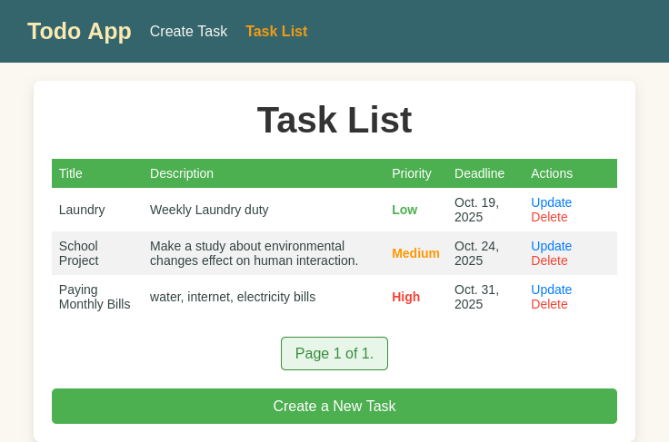

# Todo App with CRUD and Task Priority in Django 5

## Overview
This is a simple Todo App built with Django 5, allowing users to create, read, update, and delete tasks. Each task can be assigned a priority level (High, Medium, or Low) and a deadline. The tasks are displayed with pagination, allowing users to view 10 tasks per page.

## Features
- **Create Task**: Add new tasks with priority and a deadline.
- **Read Tasks**: View tasks with pagination.
- **Update Task**: Edit the task details, including priority and deadline.
- **Delete Task**: Remove tasks from the list.
- **Priority Levels**: Tasks can be assigned one of three priority levels: High, Medium, or Low.
- **Deadline**: Tasks have a deadline date to help manage time-sensitive tasks.
- **Pagination**: View tasks page-by-page with 10 tasks per page.

---

## Requirements
- Python 3.8+
- Django 5+
- SQLite (or any other DB supported by Django)    